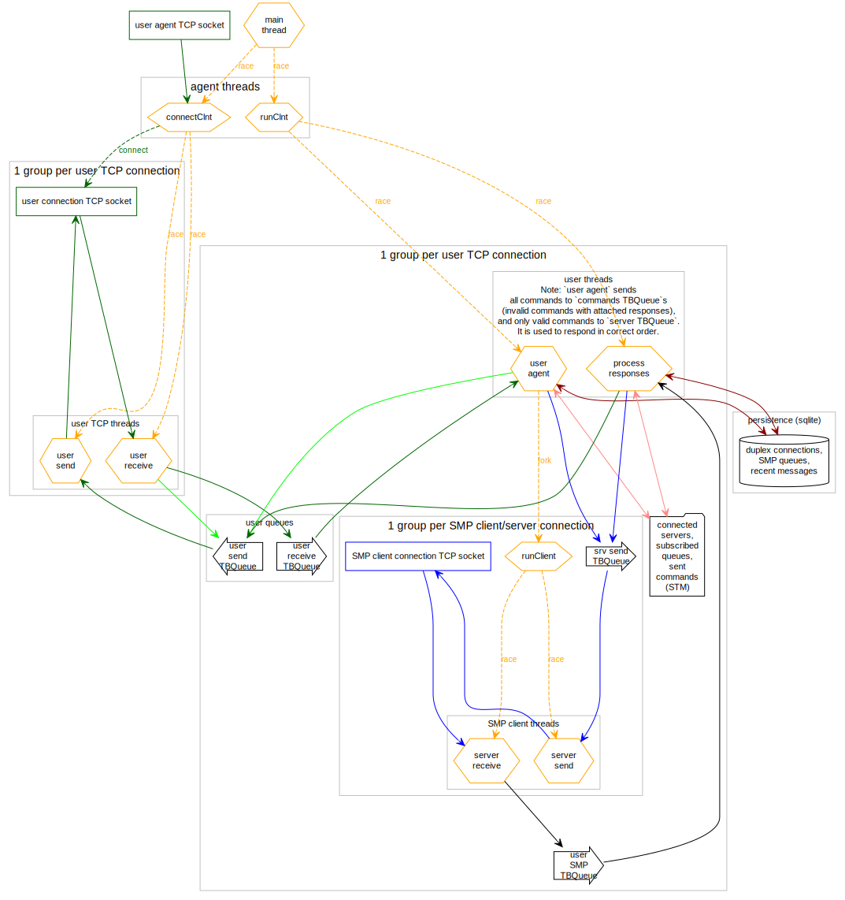

# SimpleXMQ

## Message broker for unidirectional (simplex) queues

SimpleXMQ is a message broker for managing message queues and sending messages over public network. It consists of SMP server, SMP client library and SMP agent that implement [SMP protocol](./protocol/simplex-messaging.md) for client-server communication and [SMP agent protocol](./protocol/agent-protocol.md) to manage duplex connections via simplex queues on multiple SMP servers.

SMP protocol is inspired by [Redis serialization protocol](https://redis.io/topics/protocol), but it is much simpler - it currently has only 8 client commands and 6 server responses.

SimpleXMQ is implemented in Haskell - it benefits from robust software transactional memory (STM) and concurrency primitives that Haskell provides.

## SimpleXMQ roadmap

- Streams - high performance message queues. See [Streams RFC](./rfcs/2021-02-28-streams.md) for details.
- "Small" connection groups, when each message will be sent by the SMP agent to multiple connections with a single client command. See [Groups RFC](./rfcs/2021-03-18-groups.md) for details.
- SMP agents cluster to share connections and message management by multiple agents (for example, it would enable multi-device use for [simplex-chat](https://github.com/simplex-chat/simplex-chat)).
- SMP queue redundancy and rotation in SMP agent duplex connections.
- "Large" groups design and implementation. 

## Components

### SMP server

[SMP server](./apps/smp-server/Main.hs) can be run on any Linux distribution without any dependencies. It uses in-memory persistence with an optional append-only log of created queues that allows to re-start the server without losing the connections. This log is compacted on every server restart, permanently removing suspended and removed queues.

To enable the queue logging, uncomment `enable: on` option in `smp-server.ini` configuration file that is created the first time the server is started.

On the first start the server generates an RSA key pair for encrypted transport handshake and outputs hash of the public key every time it runs - this hash should be used as part of the server address: `<hostname>:5223#<key hash>`.

SMP server implements [SMP protocol](./protocol/simplex-messaging.md).

### SMP client library

[SMP client](./src/Simplex/Messaging/Client.hs) is a Haskell library to connect to SMP servers that allows to:
- execute commands with a functional API.
- receive message and other notifications via STM queue.
- automatically send keep-alive commands.

### SMP agent

[SMP agent library](./src/Simplex/Messaging/Agent.hs) can be used to run SMP agent as part of another application and to communicate with the agent via STM queues, without serializing and parsing commands and responses.

Haskell type [ACommand](./src/Simplex/Messaging/Agent/Transmission.hs) represents SMP agent protocol to communicate via STM queues.

See [simplex-chat](https://github.com/simplex-chat/simplex-chat) terminal UI for the example of integrating SMP agent into another application.

[SMP agent executable](./apps/smp-agent/Main.hs) can be used to run a standalone SMP agent process that implements plaintext [SMP agent protocol](./protocol/agent-protocol.md) via TCP port 5224, so it can be used via telnet. It can be deployed in private networks to share access to the connections between multiple applications and services.

## Using SMP server and SMP agent

You can either run SMP server locally or try local SMP agent with the deployed demo server:

`smp1.simplex.im:5223#pLdiGvm0jD1CMblnov6Edd/391OrYsShw+RgdfR0ChA=`

It's the easiest to try SMP agent via a prototype [simplex-chat](https://github.com/simplex-chat/simplex-chat) terminal UI.

## SMP server design

## SMP agent design

## License

[AGPL v3](./LICENSE)
